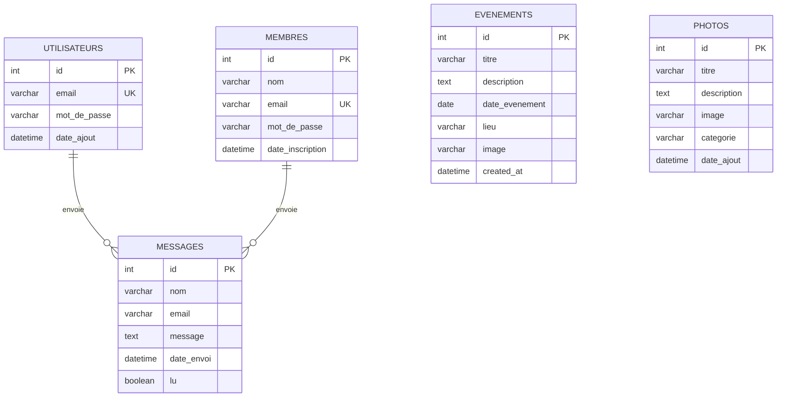

<div align="center">

# 🌟 Aujourd'hui vers Demain

### Plateforme Web de Gestion Associative

[](https://php.net)
[](https://mysql.com)
[](https://getbootstrap.com)
[](LICENSE)

*Application web complète développée pour l'association "Aujourd'hui vers Demain" de Noisy-le-Sec*

[📖 Documentation](#-fonctionnalités) • [🚀 Installation](#-installation-rapide) • [📸 Captures](#-captures-décran) • [👥 Équipe](#-équipe)

---


</div>

## 📋 À Propos

> **Projet de stage** réalisé dans le cadre de notre formation en développement web.

L'association **Aujourd'hui vers Demain** accompagne les habitants du quartier dans leur quotidien : aide aux devoirs, événements de quartier, bénévolat... Ce projet vise à **digitaliser** leurs activités grâce à une plateforme moderne et intuitive.

### 🎯 Objectifs du Projet

| Objectif | Description |
|----------|-------------|
| 🗄️ **Base de données** | Conception et modélisation d'une BDD relationnelle complète |
| 💻 **Développement Full-Stack** | Interface utilisateur moderne + logique serveur robuste |
| 🔐 **Back-Office sécurisé** | Espace d'administration complet pour l'association |
| 📱 **Responsive Design** | Compatible mobile, tablette et desktop |
| 📊 **Exports professionnels** | Export Excel, CSV et génération de reçus PDF |

---

## ✨ Fonctionnalités

### 🌐 Site Public (Front-Office)

<table>
<tr>
<td width="50%">

**🏠 Page d'Accueil**
- Design moderne "One Page"
- Animations fluides (AOS Library)
- Mode Sombre / Clair
- Section héro dynamique
- Statistiques animées

</td>
<td width="50%">

**📅 Gestion des Événements**
- Affichage des événements à venir
- Moteur de recherche intégré
- Pagination automatique
- Cartes avec images et détails

</td>
</tr>
<tr>
<td>

**📝 Inscriptions Aide aux Devoirs**
- Formulaire complet (nom, prénom, classe, adresse, téléphone, email)
- Pré-remplissage automatique pour les membres
- Validation des données en temps réel
- Confirmation visuelle après inscription

</td>
<td>

**🖼️ Galerie Photos**
- Affichage dynamique par catégories
- Filtres et tri par date
- Effet Lightbox au clic
- Photos événements + galerie

</td>
</tr>
<tr>
<td>

**❤️ Bénévolat**
- Formulaire de candidature complet
- Upload de CV (PDF, Word, Images)
- Champs disponibilités et compétences
- Réservé aux membres connectés

</td>
<td>

**📞 Contact**
- Formulaire de contact sécurisé
- Protection anti-spam
- Informations de l'association
- Carte interactive

</td>
</tr>
</table>

### 🔧 Espace Administrateur (Back-Office)

| Fonctionnalité | Description |
|----------------|-------------|
| 🔐 **Connexion sécurisée** | Authentification avec hachage bcrypt + protection brute force |
| 📊 **Dashboard** | Vue d'ensemble des événements avec statistiques |
| ➕ **CRUD Événements** | Créer, modifier, supprimer avec upload d'images |
| 🖼️ **Gestion Galerie** | Ajouter/supprimer des photos par catégorie |
| 📬 **Messagerie** | Centralisation des demandes (contact, inscriptions, bénévolat) |
| 📋 **Gestion Inscriptions** | Tableau des inscrits à l'aide aux devoirs |
| ✏️ **Modification Inscriptions** | Éditer les informations des enfants inscrits |
| 📥 **Export CSV/Excel** | Téléchargement des inscriptions avec mise en forme professionnelle |
| 📄 **Génération PDF** | Reçus d'inscription personnalisés avec logo |
| 🛡️ **Sécurité** | Logs de connexion et gestion des sessions |

### 📊 Nouvelles Fonctionnalités Pro

<table>
<tr>
<td width="33%" align="center">

**📥 Export Excel**


Export formaté avec :
- En-têtes colorés
- Colonnes auto-ajustées
- Alternance de couleurs

</td>
<td width="33%" align="center">

**📄 Génération PDF**


Reçus professionnels avec :
- Logo de l'association
- Informations complètes
- Rappel des horaires

</td>
<td width="33%" align="center">

**✏️ Gestion Complète**


Actions disponibles :
- Modifier les inscriptions
- Envoyer des emails
- Supprimer les entrées

</td>
</tr>
</table>

### 🛡️ Sécurité Implémentée

- ✅ Protection CSRF sur tous les formulaires
- ✅ Hachage des mots de passe (`password_hash` bcrypt)
- ✅ Requêtes préparées (PDO) contre les injections SQL
- ✅ Validation et échappement des données (`htmlspecialchars`)
- ✅ Protection des uploads (types et tailles de fichiers)
- ✅ Sessions sécurisées avec timeout
- ✅ Limitation des tentatives de connexion
- ✅ Protection des dossiers via `.htaccess`

---

## 🛠️ Stack Technique

<div align="center">

| Catégorie | Technologies |
|-----------|--------------|
| **Back-End** |  |
| **Base de Données** |  |
| **Front-End** |    |
| **Framework CSS** |  |
| **Icônes** |  |
| **Animations** |  |
| **PDF** |  |
| **Excel** |  |
| **Outils** |     |

</div>

---

## 🚀 Installation Rapide

### Prérequis

- PHP 8.0 ou supérieur
- MySQL 5.7 ou supérieur
- Composer (pour les dépendances)
- Serveur local (Laragon, WAMP, XAMPP...)

### Étapes d'installation

```bash
# 1. Cloner le dépôt
git clone https://github.com/tanaa75/Aujourdhui-vers-demain-stage.git

# 2. Accéder au dossier
cd Aujourdhui-vers-demain-stage

# 3. Installer les dépendances PHP
composer install
```

### Configuration de la base de données

1. **Créer la base de données** dans phpMyAdmin :
   ```sql
   CREATE DATABASE asso_db CHARACTER SET utf8mb4 COLLATE utf8mb4_unicode_ci;
   ```

2. **Importer les tables** : Exécutez le script `database/schema.sql`

3. **Configurer la connexion** dans `includes/db.php` :
   ```php
   $host = 'localhost';
   $dbname = 'asso_db';
   $username = 'root';
   $password = '';
   ```

### Accès à l'application

| Page | URL | Identifiants |
|------|-----|--------------|
| 🏠 Site public | `http://localhost/aujourdhui-vers-demain/` | - |
| 🔐 Connexion Admin | `http://localhost/aujourdhui-vers-demain/auth/login.php` | `admin` / `admin123` |
| 📊 Dashboard | `http://localhost/aujourdhui-vers-demain/admin/dashboard.php` | Connexion requise |
| 📋 Inscriptions | `http://localhost/aujourdhui-vers-demain/admin/inscriptions.php` | Connexion requise |

---

## 📁 Structure du Projet

```
aujourdhui-vers-demain/
│
├── 📁 admin/                    # 🔧 Back-Office Administration
│   ├── dashboard.php            # Gestion des événements
│   ├── galerie.php              # Gestion galerie photos
│   ├── messages.php             # Messagerie centralisée
│   ├── inscriptions.php         # Liste des inscriptions aide aux devoirs
│   ├── edit_inscription.php     # Modifier une inscription
│   ├── export_inscriptions.php  # Export CSV & Excel
│   └── generate_pdf.php         # Génération reçus PDF
│
├── 📁 auth/                     # 🔐 Authentification
│   ├── login.php                # Connexion admin
│   ├── inscription.php          # Inscription membre
│   ├── connexion.php            # Connexion membre
│   └── logout.php               # Déconnexion
│
├── 📁 pages/                    # 🌐 Pages Publiques
│   ├── actions.php              # Nos actions (aide aux devoirs)
│   ├── galerie.php              # Galerie photos dynamique
│   ├── benevolat.php            # Devenir bénévole
│   └── contact.php              # Formulaire de contact
│
├── 📁 includes/                 # ⚙️ Fichiers partagés
│   ├── db.php                   # Configuration BDD
│   ├── navbar.php               # Barre de navigation
│   ├── footer.php               # Pied de page
│   ├── security.php             # Fonctions de sécurité (CSRF)
│   └── config.php               # Configuration globale
│
├── 📁 assets/                   # 🎨 Ressources statiques
│   ├── css/
│   │   ├── index.css            # Styles page d'accueil
│   │   ├── admin.css            # Styles administration
│   │   └── mobile-responsive.css # Styles responsive
│   └── js/
│       ├── index.js             # Scripts page d'accueil
│       └── script_theme.js      # Gestion thème jour/nuit
│
├── 📁 uploads/                  # 📤 Fichiers uploadés
│   ├── events/                  # Images événements
│   ├── gallery/                 # Photos galerie
│   └── cv/                      # CV des bénévoles
│
├── 📁 vendor/                   # 📦 Dépendances Composer
│   ├── phpoffice/phpspreadsheet # Export Excel
│   └── tecnickcom/tcpdf         # Génération PDF
│
├── 📁 pages/legal/              # ⚖️ Pages légales
│   ├── mentions.php             # Mentions légales
│   └── confidentialite.php      # Politique de confidentialité
│
├── 📄 index.php                 # Page d'accueil principale
├── 📄 composer.json             # Dépendances PHP
└── 📄 README.md                 # Documentation
```

---

## 📸 Captures d'écran

<div align="center">

### 🏠 Page d'Accueil

| Mode Clair | Mode Sombre |
|------------|-------------|
|  |  |

### 🔧 Administration

| Dashboard | Inscriptions |
|-----------|--------------|
|  |  |

### 📊 Exports

| Export Excel | Reçu PDF |
|--------------|----------|
|  |  |

</div>

---

## 🗄️ Schéma de la Base de Données



---

## 📦 Dépendances

### Composer (PHP)

```json
{
    "require": {
        "phpoffice/phpspreadsheet": "^5.4",
        "tecnickcom/tcpdf": "^6.10"
    }
}
```

### CDN (Front-End)

| Librairie | Version | Usage |
|-----------|---------|-------|
| Bootstrap | 5.3.0 | Framework CSS |
| Bootstrap Icons | 1.11.0 | Icônes |
| AOS | 2.3.1 | Animations scroll |

---

## 👥 Équipe

<div align="center">

| Développeur | Rôle | Contact |
|-------------|------|---------|
| **CA TANAVONG** | Développeur Full-Stack | [](https://github.com/tanaa75) |
| **BEDJOU AYOUB** | Développeur Full-Stack | [](https://github.com) |

</div>

---

## 📄 Licence

Ce projet a été réalisé dans le cadre d'un **stage de formation**.  
Tous droits réservés © 2026 - CA TANAVONG & BEDJOU AYOUB

---

<div align="center">

**⭐ Si ce projet vous a plu, n'hésitez pas à lui donner une étoile !**

[](https://github.com/tanaa75)
[](https://github.com/tanaa75)

</div>
